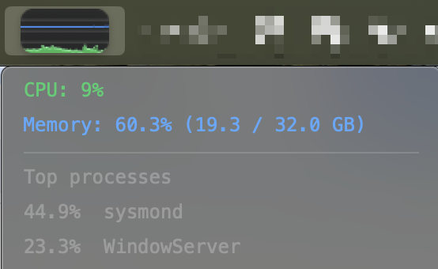

# SwiftBar CPU + Memory Usage

A [SwiftBar](https://github.com/swiftbar/SwiftBar) plugin that draws a compact,
Task-Manager-style **CPU history graph** in the macOS menu bar, with **memory
usage** overlaid as a blue line behind it.

<p align="center">
  
</p>

## Features

- **Live CPU history** rendered as a rounded, anti-aliased rectangle graph.
- **Load-based colors** for the CPU fill: green (0–30%), yellow (30–60%),
  orange (60–90%), red (>90%).
- **Memory usage** drawn as a blue line behind the CPU area.
- **Dropdown** shows current CPU %, memory % (used / total GB), and the top
  CPU-consuming processes.
- **No third-party dependencies** — the graph PNG is generated with a tiny
  pure-stdlib encoder via the system `/usr/bin/python3`.

## Install

1. Install [SwiftBar](https://github.com/swiftbar/SwiftBar)
   (`brew install swiftbar`).
2. Copy `cpu.2s.sh` into your SwiftBar plugins folder and make it executable:
   ```sh
   cp cpu.2s.sh "$(defaults read com.ameba.SwiftBar PluginDirectory)/"
   chmod +x cpu.2s.sh
   ```
3. Refresh SwiftBar. The graph fills in over the first ~minute as history
   accumulates.

The `.2s.` in the filename sets the refresh interval (every 2 seconds). Rename
it (e.g. `cpu.5s.sh`) to change the cadence.

## How it works

- **CPU** is sampled via `top -l 2` (`100 − idle`).
- **Memory** used = (active + wired + compressed) pages × page size, à la
  Activity Monitor, from `vm_stat` and `sysctl hw.memsize`.
- A rolling window of the last 60 `cpu,mem` samples is kept in
  `~/Library/Caches/swiftbar_cpu_history.txt`.
- The graph is rendered at 3× supersample and box-downscaled to @2x for smooth
  rounded corners.

## License

[MIT](LICENSE) © 2026 Guojun Chen
